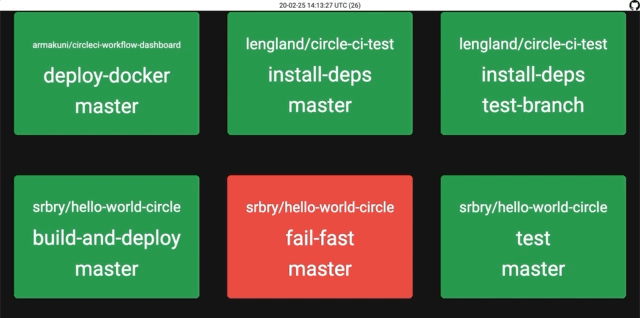
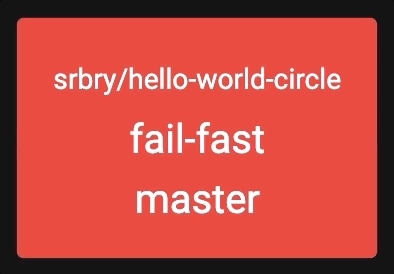
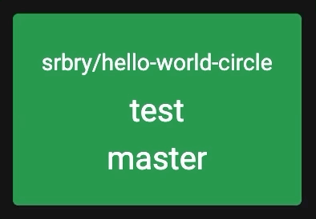

# CircleCI Workflow Dashboard

[](https://circleci.com/gh/armakuni/circleci-workflow-dashboard)

Gives a build radiator view of your CircleCI workflows.

The built in tools for CircleCI are okay if you want to see the history of everything ever. but that's not helpful for reacting to issues and failures.

To read more about why we built this tool and why we think its useful check out [our blog](https://cloudnative.ly/giving-circleci-a-focus-on-continuous-deployment-36fe835c97be).

This dashboard is designed to be displayed loud and proud to show everyone what urgent issues have been found in the builds. The quick-look nature enables teams to focus on the important stuff quickly.



## Installation

To install the dependencies for this project

```bash
go get ./...
```

## Setup

Running this dashboard requires an API token from CircleCI. Create a new one in your [User Account](https://circleci.com/account/api)

Export this as an environment variable before starting the dasboard

```bash
export CIRCLECI_TOKEN=<Personal API Token>
```

## Running

With the dependencies installed and the API Token available, start the dashboard

```bash
go run main.go
```

or

```bash
go build
./circleci-workflow-dashboard
```

By default this will run on <http://localhost:8080>

### Configuration

There are a number of configuration options that are exposed by environment variables.

| Variable          | Default                    | Description                                                                                                                                                                                                                                                                                                    |
|-------------------|----------------------------|----------------------------------------------------------------------------------------------------------------------------------------------------------------------------------------------------------------------------------------------------------------------------------------------------------------|
| CIRCLECI_TOKEN    | N\A                        | Your CircleCI API Token                                                                                                                                                                                                                                                                                        |
| PORT              | 5000                       | The port for the web server to listen on                                                                                                                                                                                                                                                                       |
| CIRCLECI_API_URL  | <https://circleci.com>     | The URL of your CircleCI instance, if you are running an on-prem install                                                                                                                                                                                                                                       |
| CIRCLECI_JOBS_URL | <https://app.circleci.com> | The URL of your CircleCI jobs, this is often has a different prefix to the API URL, if you are running an on-prem install                                                                                                                                                                                      |
| DASHBOARD_FILTER  | null                       | A filter to limit what projects are shown on your dashboard. E.g `{"username/reponame": null}`. **Note**: Right now this only filters based on the username/reponame format and will only filter projects, it has been added as a JSON map to allow the future addition of filtering branches etc per project. |

## Legend

As a dashboard, colours are important. So here's what the various colours will mean

### Successful Build

A completed, successful build will be a solid green block


### Failed Build

A completed, failed build will be a solid red block


**Note**: The following states all display the last completed build colour from above, but with an indicator that something else is happening

### In Progress Build

A build that is currently running will have a bouncing blue border



### On Hold Build

A build that is on hold - normally requiring a Manual Approval - will have a bouncing purple border



### Cancelled Build

A manually cancelled build will have a static grey border


## Docker

We also distribute the dashboard as a docker image

```bash
docker run -e CIRCLECI_TOKEN=<api_token> --rm -ti -p 8080:8080 armakuni/circleci-workflow-dashboard
```

If you want to start run on a different port change change the `-p` param. For example `-p 80:8080` will start the service on port `80`.

**Note**: As this is done via port mapping in docker you will still see the output as starting on port `8080`.

### Building the image

```bash
./scripts/docker_build.sh
```

## Testing

```sh
ginkgo -r
```

### Generating the mocks

```sh
go get github.com/vektra/mockery/.../
mockery -dir circleci -name CircleCI
```
