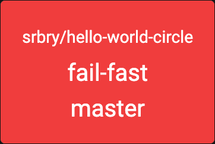
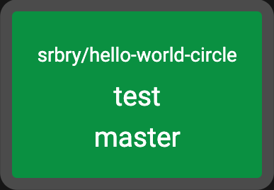

# CircleCI Workflow Dashboard

Gives a build radiator view of your CircleCI workflows.

The built in tools for CircleCI are okay if you want to see the history of everything ever. but that's not helpful for reacting to issues and failures.

This dashboard is designed to be displayed loud and proud to show everyone what urgent issues have been found in the builds. The quick-look nature enables teams to focus on the important stuff quickly.


## Installation

This project uses [Poetry](https://python-poetry.org/) to manage dependencies. Make sure this is [installed](https://python-poetry.org/docs/#installation)

To install the dependencies for this project, run poetry

```bash
poetry install
```

## Setup

Running this dashboard requires an API token from CircleCI. Create a new one in your [User Account](https://circleci.com/account/api)

Export this as an environment variable before starting the dasboard

```bash
export CIRCLECI_TOKEN=<Personal API Token>
```

## Running

With the dependencies installed and the API Token available, start the dashboard via poetry

```bash
poetry run python app.py
```

By default this will run on <http://localhost:5000>

### Configuration

There are a number of configuration options that are exposed by environment variables.

| Variable          | Default                    | Description                                                                                                               |
|-------------------|----------------------------|---------------------------------------------------------------------------------------------------------------------------|
| CIRCLECI_TOKEN    | N\A                        | Your CircleCI API Token                                                                                                   |
| PORT              | 5000                       | The port for the web server to listen on                                                                                  |
| CIRCLECI_API_URL  | <https://circleci.com>     | The URL of your CircleCI instance, if you are running an on-prem install                                                  |
| CIRCLECI_JOBS_URL | <https://app.circleci.com> | The URL of your CircleCI jobs, this is often has a different prefix to the API URL, if you are running an on-prem install |

## Legend

As a dashboard, colours are important. So here's what the various colours will mean

### Successful Build

A completed, successful build will be a solid green block


### Failed Build

A completed, failed build will be a solid red block



**Note**: The following states all display the last completed build colour from above, but with an indicator that something else is happening

### In Progress Build

A build that is currently running will have a bouncing blue border


### On Hold Build

A build that is on hold - normally requiring a Manual Approval - will have a bouncing purple border


### Cancelled Build

A manually cancelled build will have a static grey border



## Docker

We also distribute the dashboard as a docker image

```bash
docker run -e CIRCLECI_TOKEN=<api_token> --rm -ti -p 5000:5000 armakuni/circleci-workflow-dashboard
```

If you want to start run on a different port change change the `-p` param. For example `-p 80:5000` will start the service on port `80`.

**Note**: As this is done via port mapping in docker you will still see the output as starting on port `5000`.

### Building the image

```bash
./scripts/docker_build.sh
```
